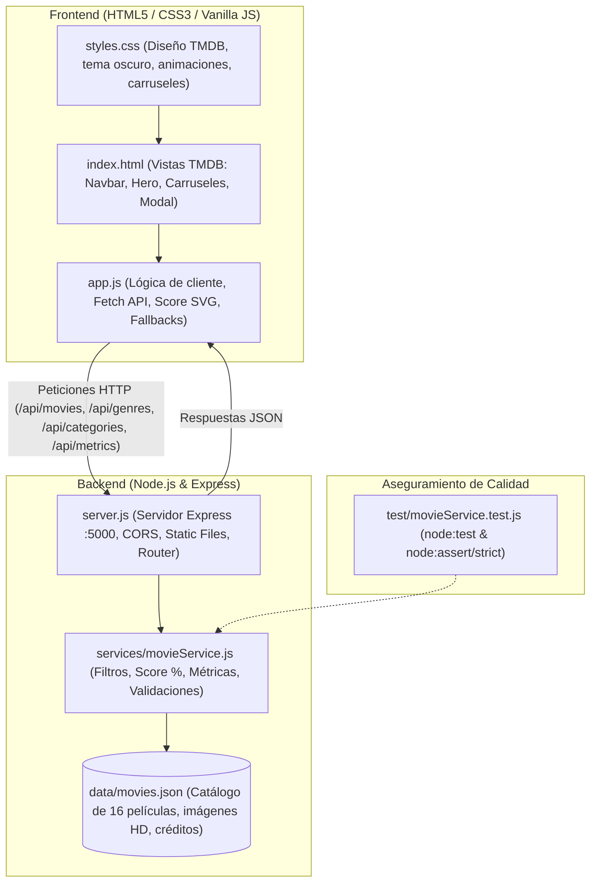

# Evidencia de Inspección: Resumen de Arquitectura y Herramientas MCP Utilizadas

**Repositorio evaluado:** `RubenPerez55/Movies-ADA06`  
**Servidor MCP utilizado:** `github-Readonly`  
**Modalidad de ejecución:** Solo Lectura (Read-Only) — Principio de mínimo privilegio  
**Fecha de registro:** Octubre 2026  

---

## 🛠️ 1. Lista de Tools y Capabilities de MCP Utilizadas

Durante la inspección de ingeniería del repositorio se utilizaron exclusivamente capacidades del servidor MCP de GitHub en modo solo lectura, acotadas en todo momento al alcance del repositorio objetivo (`RubenPerez55/Movies-ADA06`):

| Capacidad / Tool MCP | Toolset | Modalidad | Parámetros y Alcance | Evidencia / Resultado Obtenido |
|---|---|---|---|---|
| `list_issues` | `issues` | Read | `owner: "RubenPerez55"`, `repo: "Movies-ADA06"` | Identificación del **Issue #1**: *"Implementar vistas del catalogo de peliculas y API REST (Clon TMDB)"*, estado abierto con tareas planificadas. |
| `issue_read` | `issues` | Read | `issue_number: 1`, `method: "get"`, `owner/repo` | Consulta de la descripción completa, checklist de tareas, autor (`RubenPerez55`) y confirmación del vínculo de cierre con el **PR #2** (`closed_by_pull_requests`). |
| `list_pull_requests` | `pull_requests` | Read | `state: "all"`, `owner/repo` | Identificación del **Pull Request #2**: *"feat: Implementacion de vistas de Frontend y Backend estilo TMDB"*, rama base `main`, rama origen `feature/tmdb-ui-and-api`. |
| `pull_request_read` | `pull_requests` | Read | `pullNumber: 2`, `method: "get"`, `owner/repo` | Verificación de metadatos del PR #2: estado `open`, `mergeable_state: "clean"`, 11 archivos afectados, +3687 adiciones. |
| `pull_request_read` | `pull_requests` | Read | `pullNumber: 2`, `method: "get_files"`, `owner/repo` | Inspección detallada de archivos impactados por el PR: `backend/`, `frontend/`, `data/movies.json`, servicios, pruebas unitarias y documentación. |
| `list_branches` | `repos` | Read | `owner/repo` | Consulta de ramas remotas disponibles: rama principal `main` y rama de trabajo `feature/tmdb-ui-and-api`. |
| `get_file_contents` | `repos` | Read | `path: ""`, `ref: "main"`, `owner/repo` | Exploración de la estructura del árbol raíz en la rama `main` original (`package.json`, `README.md`, `.gitignore`, `AI_USAGE_LOG.md`). |
| `get_file_contents` | `repos` | Read | `path: ""`, `ref: "feature/tmdb-ui-and-api"`, `owner/repo` | Exploración de la estructura completa en la rama del PR, detectando los directorios `backend/` y `frontend/`. |
| `get_file_contents` | `repos` | Read | `path: "backend/services"`, `path: "backend/test"`, `ref: "feature/..."` | Auditoría de la existencia y tamaño de los módulos de servicio (`movieService.js`) y pruebas unitarias (`movieService.test.js`). |
| `get_commit` | `commits` | Read | `sha: "7336400ff3d5ba0ef4411b01f98a143d7721d9b9"`, `owner/repo` | Auditoría del último commit de la rama: *"feat: pruebas unitarias con node:test, movieService y correccion de imagenes TMDB con fallbacks"*. |
| `search_code` | `search` | Read | `query: "movieService repo:RubenPerez55/Movies-ADA06"` | Prueba de indexación de código en GitHub para corroborar visibilidad de símbolos en el repositorio remoto. |

> **Garantía de Seguridad:** Ninguna herramienta de modificación (`create_issue`, `create_pull_request`, `push_files`, `merge_pull_request`, etc.) fue invocada ni se encuentra disponible en este servidor. El estado de GitHub permaneció inalterado.

---

## 🏛️ 2. Resumen de la Arquitectura Observada

El repositorio implementa una arquitectura desacoplada cliente-servidor (Frontend SPA estático y Backend REST API) con base de datos en JSON local y capa de pruebas unitarias nativas:



---

### 📂 Estructura de Componentes y Módulos

```text
Movies-ADA06/
├── package.json                  # Orquestación raíz (scripts: start, dev, test, install:all)
├── README.md                     # Documentación técnica, endpoints y guía del PAT de solo lectura
├── AI_USAGE_LOG.md               # Bitácora de uso de Inteligencia Artificial para el curso
├── .gitignore                    # Reglas de exclusión de dependencias y temporales
├── docs/
│   ├── MCP_GITHUB_TOOL_INVENTORY.md   # Inventario de tools MCP y matriz de riesgos
│   └── EVIDENCIA_ARQUITECTURA_Y_TOOLS.md # Resumen de arquitectura y evidencia de ejecución MCP
├── backend/
│   ├── package.json              # Configuración y dependencias (express, cors)
│   ├── server.js                 # Punto de entrada del backend y enrutador REST API
│   ├── data/
│   │   └── movies.json           # Base de datos con 16 películas estructuradas
│   ├── services/
│   │   └── movieService.js       # Capa de reglas de negocio y utilidades
│   └── test/
│       └── movieService.test.js  # Pruebas unitarias nativas
└── frontend/
    ├── index.html                # Estructura de vistas, banner, carruseles y modales
    ├── styles.css                # Paleta TMDB (#032541), layout responsivo e insignias
    └── app.js                    # Cliente web, consumo asíncrono, eventos y renderizado
```

---

### 📍 Puntos de Entrada de la Aplicación

1. **Backend / API REST:**
   - **Archivo:** `backend/server.js`
   - **Comando:** `npm start` (o `node backend/server.js`).
   - **Comportamiento:** Levanta el servidor Express en el puerto `5000`, sirve los recursos estáticos de `frontend/` y expone las rutas `/api/*`.

2. **Frontend / Cliente Web:**
   - **Archivo:** `frontend/index.html`
   - **Acceso:** Disponible en `http://localhost:5000` una vez iniciado el servidor backend.
   - **Carga de lógica:** `frontend/app.js` se inicializa al dispararse el evento `DOMContentLoaded`.

3. **Suite de Pruebas Unitarias:**
   - **Comando:** `npm test`
   - **Ejecución:** Invoca el test runner nativo de Node.js: `node --test backend/test/movieService.test.js`.

---

### 🧩 Módulos y Responsabilidades Clave

| Módulo | Archivo | Responsabilidad Principal |
|---|---|---|
| **Servidor API** | `backend/server.js` | Configura Express, habilita CORS, sirve estáticos del frontend y responde en `/api/movies`, `/api/movies/:id`, `/api/genres`, `/api/categories`, `/api/metrics`, `/api/health`. |
| **Lógica de Catálogo** | `backend/services/movieService.js` | Funciones puras desacopladas: `filterMovies` (filtros combinados), `formatMovieScore` (porcentajes y semáforo cromático TMDB), `formatDateSpanish` (fechas legibles), `calculateCatalogMetrics` (agregaciones estadísticas) y `validateMovie` (esquema). |
| **Almacén de Datos** | `backend/data/movies.json` | 16 registros de películas completas con títulos, sinopsis, fechas, calificaciones, categorías (`trending`, `popular`, `top_rated`, `upcoming`), géneros, pósters verificados, tráileres oficiales de YouTube y reparto con avatares. |
| **Cliente Web** | `frontend/app.js` | Maneja peticiones `fetch()` a la API, renderiza tarjetas de películas, inyecta insignias SVG de puntuación, controla los botones de desplazamiento de carruseles, gestiona el buscador en tiempo real y abre el modal de detalle con iframe de video. |
| **Diseño y Estilos** | `frontend/styles.css` | Define la estética oficial TMDB: barra de navegación oscura, degradados corporativos, tipografía moderna, badges circulares con gradientes y modales responsivos. |
| **Suite de Pruebas** | `backend/test/movieService.test.js` | 5 bloques de prueba con aserciones estrictas que validan filtrado, puntuación, normalización de errores, formateo de fechas, cálculo de métricas y validación de esquema. |

---

## 🎯 3. Relación con Issue #1 y Pull Request #2

- **Issue #1 (`Implementar vistas del catalogo de peliculas y API REST (Clon TMDB)`):**  
  Definió los requisitos funcionales del clon: estructura base, vistas de exploración, búsqueda, filtros de género, modal con tráiler, API REST en Express y bitácora de IA.
- **Pull Request #2 (`feat: Implementacion de vistas de Frontend y Backend estilo TMDB`):**  
  Implementó la solución técnica completa desde la rama `feature/tmdb-ui-and-api` hacia `main` e incluyó la directiva `Closes #1`.
- **Áreas de impacto directo:**  
  La arquitectura modular permite que cualquier cambio en los filtros o datos impacte de forma aislada a través de `movieService.js` sin alterar el servidor Express ni la vista del frontend, garantizando mantenibilidad y facilidad de prueba.
